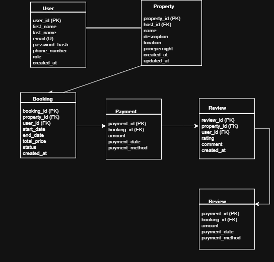

# ER Diagram – ALX Airbnb Database Project

## 🔍 Entities and Attributes

- **User**
  - user_id (PK), first_name, last_name, email, password_hash, phone_number, role, created_at

- **Property**
  - property_id (PK), host_id (FK), name, description, location, pricepernight, created_at, updated_at

- **Booking**
  - booking_id (PK), property_id (FK), user_id (FK), start_date, end_date, total_price, status, created_at

- **Payment**
  - payment_id (PK), booking_id (FK), amount, payment_date, payment_method

- **Review**
  - review_id (PK), property_id (FK), user_id (FK), rating, comment, created_at

- **Message**
  - message_id (PK), sender_id (FK), recipient_id (FK), message_body, sent_at

## 🔁 Relationships

- One user can book many properties
- One property can be booked many times
- One booking has one payment
- One user can write many reviews
- One property can have many reviews
- A user can send and receive many messages (self-relation)

## 📸 ERD Image

